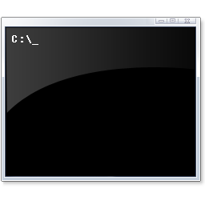

# PyRLRR
Converts MIDI files into the Paradiddle compatible RLRR format

## Getting Started
Make sure you have these installed:
- **Python 3**
- **Git** *(Optional)*

### Step 1: 


Go ahead and download the code from this repository. You can either do this by going to the green `Code` button in the top right of the files and clicking Download ZIP

or 

If you are using Git, clone the repository onto your computer with: 

>`git clone https://github.com/UnofficialParadiddle/PyRLRR.git`

### Step 2:

<p float="left">
  
   
  
</p>

Go ahead and open up your terminal of choice. If you are on a Windows system, using `CMD` or `Powershell` will be best for this

Next, we need to set the terminal to the location of the PyRLRR folder. To do this get the path of the PyRLRR folder through the file explorer, and enter `cd path_to_folder` into the terminal

### Step 3:
Now with our terminal set up, all we need to do is install everything thats required for the project to work, which is easily done with putting `python -m pip install -r requirements.txt` into the terminal.

## Running PyRLRR
Before we run the program, we need to get the folder structure setup. You need to have all the song folders you want to convert inside of one folder that the program will read from.

For example:

I have a folder called `Songs`, and inside the folder there are songs I want to convert. It should be setup like so:

```
Songs\
|--Twenty One Sailors\
|--Metalicka
|--etc..
```

Go ahead and grab the path of that folder you have setup, and you want to input `python PyRLRR path_to_songs` into the terminal.

For my example, I would run `python PyRLRR Songs`

If everything works right, you should have your songs converting!

## PyRLRR Options
PyRLRR has many different options built into the program as to make the experience of using the program both easier and more customizable.
<br></br>
### Changing "drumset.rlrr"
To change what instruments are included within your songs, go ahead and add `-d` or `--drumset` with the path to your 'drumset.rlrr' file to the end of the command like so:

> `python PyRLRR Songs -d path_to_drumset.rlrr`

<br></br>
### Changing notes with different YAML file
To change how notes are registered in your newly generated songs, add `-y` or `--yaml` with the path to your 'notes.yaml' file to the end of the command like so:

> `python PyRLRR songs -y path_to_notes.yaml`

<br></br>
### Output all generated songs to new directory
If you want to put all your new songs into a separate directory, all you need to do is add `-o` or `--output` with the path to where you want songs to be placed, to the end of your command like so:

> `python PyRLRR songs -o GeneratedSongs`

Don't worry, PyRLRR will create new directories for all your newly generated songs, and will also create the directory for your output if it doesn't exist.

<br></br>
### Using multiple options

PyRLRR allows the use of multiple options like so:

> `python PyRLRR Songs -d drumset.rlrr -y notes.yaml -o GeneratedSongs`

The command reads as follows:
- Convert all songs within 'Songs' folder
- For instruments, use the 'drumset.rlrr' file
- For notes, use all data listed within 'notes.yaml' file
- Output all of the converted songs to GeneratedSongs

<br></br>
### List off all available options within program
There are many more commands that PyRLRR offers that I am unable to list off within this introduction. If you would like a list of all options and their descriptions, run `-h` or `--help` at the end of the command.

> `python PyRLRR -h`